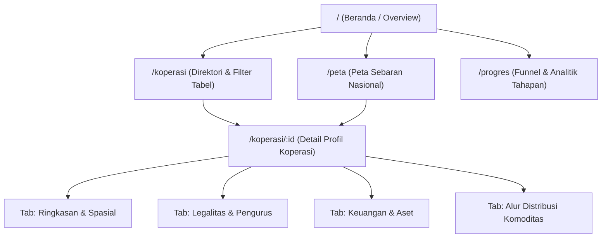

# Implementation Plan: Dashboard Monitoring & Spasial Kopdes Merah Putih (KDMP)
**Fokus: View-First, Viewer Read-Only, Data Sebaran Nasional, Anti-AI Slop**

Dokumen ini disusun sebagai panduan teknis implementasi langsung platform monitoring Kopdes Merah Putih, menggabungkan spesifikasi PRD (01–05), hasil analisis positioning terhadap `simkopdes.go.id`, serta preferensi pengguna (*view-first*, puluhan data se-Indonesia, logo resmi, hosting Vercel, dan kepatuhan penuh standar Anti-Slop).

---

## 1. Positioning & Peran Platform

Berdasarkan analisis terhadap ekosistem `simkopdes.go.id`:

| Dimensi | SIMKOPDES Resmi (`simkopdes.go.id`) | Platform Monitoring Ini (KDMP Analytics) |
|---|---|---|
| **Peran Utama** | Sistem operasional transaksional & administrasi pendaftaran koperasi desa | **Executive & Public Spatial Monitoring Dashboard (Viewer Read-Only)** |
| **Audiens** | Pengurus koperasi, verifikator dinas daerah, admin kementerian | Pimpinan program, analis kebijakan, mitra BUMN/swasta, publik |
| **Fokus Data** | Formulir input, validasi dokumen legalitas, operasional harian | **Peta sebaran spasial, visualisasi tahapan progres (funnel), metrik agregat nasional, dan profil komoditas** |
| **Akses Tulis** | Form pendaftaran, verifikasi berjenjang | **Read-Only (Fase 1)**: Semua data disajikan via query teroptimasi tanpa form pendaftaran |

---

## 2. Parameter Kunci Proyek

1. **Skala Data**: Puluhan data koperasi dummy (~50 unit) yang tersebar proporsional di **seluruh 38 provinsi Indonesia**.
   - Setiap titik dipastikan memiliki koordinat realistis di daratan (*on-land coordinates*).
   - Memiliki data lengkap: nama koperasi, nomor registrasi KDMP, alamat (Desa, Kecamatan, Kab/Kota, Provinsi), legalitas, pengurus, jenis usaha, aset, SHU, serta status tahapan.
2. **Prioritas Pengembangan (*View-First*)**:
   - Utamakan antarmuka visual yang matang, interaktif, dan informatif.
   - Peta interaktif nasional dengan clustering dinamis dan panel detail (*drawer/sheet*).
   - Profil koperasi komprehensif mencakup metrik performa dan alur komoditas/produk.
3. **Identitas & Branding**:
   - Menggunakan logo resmi **Koperasi Desa Merah Putih**.
   - Tipografi utama: **Plus Jakarta Sans** (tipografi lokal berkualitas tinggi, modern, formal).
   - Nuansa warna: Institusional merah-putih elegan (merah crimson sebagai aksen identitas terukur, latar belakang kontras tinggi yang nyaman untuk data density).
4. **Infrastruktur & Hosting**:
   - Framework: **Next.js (App Router, TypeScript strict)**.
   - Styling: **Tailwind CSS + Shadcn/ui** yang dikustomisasi tokennya.
   - Database: **PostgreSQL (Neon / Vercel Postgres)** + Prisma ORM.
   - Engine Peta: **MapLibre GL** + Vector Tiles (OpenFreeMap / Positron bersih).
   - Deployment: **Vercel** (Edge network `sin1` Singapura untuk latensi minimal ke Indonesia).

---

## 3. Penerapan Standar Anti-AI Slop

Sesuai direktif Anti-Slop, antarmuka ini dirancang tanpa pola-pola generik AI:

| Aspek | Dilarang (AI Slop) | Diterapkan (Standar Antislop) |
|---|---|---|
| **Warna & Status** | Palet pelangi 8 warna acak untuk status tahapan | **Ramp Sekuensial Monokrom/Netral + Aksen Tunggal**: Tahapan awal hingga operasional menggunakan intensitas terstruktur; warna merah khusus untuk status kendala/macet. |
| **Hierarki Visual** | "Card soup" (semua elemen dibungkus kotak kartu dengan bayangan tebal) | Hierarki berbasis garis batas tipis (*subtle border*), kontras latar, dan whitespace terukur. Bayangan hanya untuk elemen mengambang (*flyout/modal/bottom-sheet*). |
| **Peta** | Peta statis tanpa koordinat nyata atau titik jatuh di laut | Peta interaktif MapLibre GL dengan batasan wilayah Indonesia (`maxBounds`), navigasi `flyTo` saat memilih item, dan titik koordinat tervalidasi daratan. |
| **Copywriting** | Frasa klise ("Explore our cutting-edge AI cooperative ecosystem...") | Bahasa lugas, institusional, dan spesifik ("Pantau Sebaran", "Unduh Rekap CSV", "Data per Oktober 2026"). |
| **Transparansi Data** | Menampilkan data buatan seolah-olah data live kementerian | Banner permanen yang jelas: **"Mode Pratinjau: Menampilkan Data Simulasi Sebaran Nasional"**. |
| **Responsivitas** | Tampilan mobile yang terpotong atau tabel meluber | Adaptif penuh: panel detail peta otomatis bertransformasi menjadi *bottom sheet* di layar ponsel (375px+). |

---

## 4. Arsitektur Informasi & Rute Halaman

### Rincian Halaman:
1. **`/` (Dashboard Overview)**:
   - Kartu metrik utama (Total Koperasi Binaan, Anggota Terdaftar, Total Aset Nasional, Volume Usaha).
   - Mini-Peta Sebaran Nasional dengan tautan langsung ke tampilan penuh.
   - Grafik distribusi tahapan perkembangan (Persiapan → Kelembagaan → Operasional).
   - Tabel ringkas koperasi terbaru dan daftar unit yang memerlukan atensi.
2. **`/peta` (Peta Spasial Sebaran Nasional)**:
   - Peta layar penuh (*full-bleed*) dengan navigasi zoom dan reset batas wilayah Indonesia.
   - Clustering otomatis saat zoom-out, titik presisi saat zoom-in.
   - Filter cepat berdasarkan: Provinsi, Status Usaha, dan Komoditas Utama.
   - Panel samping (desktop) / Bottom Sheet (mobile) berisi ringkasan info koperasi terpilih dengan tautan menuju profil lengkap.
3. **`/koperasi` (Direktori Data)**:
   - Tabel interaktif dengan pencarian instan (nama, desa, pengurus).
   - Filter bertingkat: Wilayah (Provinsi/Kabupaten), Jenis Usaha (Pertanian, Peternakan, dsb.), Status Keaktifan.
   - Kemampuan ekspor data rekapitulasi ke format CSV/Excel.
4. **`/koperasi/[id]` (Profil Lengkap Koperasi)**:
   - Header identitas dengan logo resmi, badge status, dan nomor registrasi KDMP.
   - Tabulasi terstruktur:
     - *Ringkasan*: Info umum, koordinat peta lokal, kontak, ketua.
     - *Legalitas*: Badan hukum, NIB, tanggal SK.
     - *Keuangan*: Total Aset, Modal Sendiri, Volume Usaha, SHU tahun berjalan.
     - *Komoditas & Alur*: Produk unggulan desa dan rantai distribusi mitra (offtaker).
5. **`/progres` (Tahapan & Monitoring Program)**:
   - Visualisasi alur perkembangan koperasi dari sosialisasi, pembentukan badan hukum, permodalan, hingga mandiri operasional.
   - Daftar koperasi yang mengalami kendala operasional beserta catatan tindak lanjut.

---

## 5. Rencana Eksekusi Bertahap (Sprint Roadmap)

### Sprint 0: Fondasi Proyek, Basis Data, & Desain Sistem
- [ ] Inisialisasi arsitektur Next.js (App Router, TypeScript strict, ESLint).
- [ ] Konfigurasi Tailwind CSS dan token desain kustom sesuai panduan Anti-Slop (Plus Jakarta Sans, palet institusional, kontras WCAG AA).
- [ ] Integrasi aset logo resmi Koperasi Desa Merah Putih.
- [ ] Skema database Prisma (Entitas Provinsi, Kabupaten/Kota, Koperasi, Metrik Keuangan, Komoditas).
- [ ] Pembuatan skrip `seed.ts` berisi data realistis 50 koperasi yang terdistribusi di seluruh 38 provinsi di Indonesia dengan koordinat valid.
- [ ] Komponen layout global: Sidebar navigasi responsif, Topbar dengan indikator data contoh, dan status kesegaran data.

### Sprint 1: Peta Spasial & Direktori Koperasi
- [ ] Integrasi MapLibre GL dengan basemap vektor bebas ketergantungan API key berbayar.
- [ ] Implementasi clustering titik sebaran, popup interaktif, dan panel detail slide-over.
- [ ] Halaman `/peta` lengkap dengan kontrol navigasi wilayah (lompat ke provinsi) dan filter status.
- [ ] Halaman `/koperasi`: tabel data performan dengan paginasi, pencarian teks, dan filter multivariat.
- [ ] Fitur ekspor CSV yang menyertakan penandaan jelas data simulasi.

### Sprint 2: Executive Dashboard & Monitoring Progres
- [ ] Halaman `/`: agregasi KPI nasional, kartu tren metrik, dan ringkasan sebaran.
- [ ] Visualisasi funnel tahapan pembinaan pada halaman `/progres`.
- [ ] Panel "Perlu Atensi": daftar koperasi yang membutuhkan pendampingan khusus.
- [ ] Optimasi loading state menggunakan skeleton yang presisi tanpa pergeseran layout (*layout shift*).

### Sprint 3: Profil Detail Koperasi & Alur Komoditas
- [ ] Halaman dinamis `/koperasi/[id]` dengan navigasi tab tanpa reload.
- [ ] Komponen peta mini fokus lokasi desa koperasi bersangkutan.
- [ ] Visualisasi alur produk dan komoditas unggulan (rantai pasok desa ke pasar/offtaker).
- [ ] Rekapitulasi finansial dan struktur kepengurusan.

### Sprint 4: Uji Kelayakan Anti-Slop, Optimasi Mobile, & Deployment Vercel
- [ ] Pengujian menyeluruh responsivitas mobile (tampilan 375px ponsel hingga 1440px desktop).
- [ ] Verifikasi kontras warna, keterbacaan teks, dan audit Anti-AI Slop.
- [ ] Konfigurasi deployment Vercel dengan optimasi build production.
- [ ] Verifikasi tautan data dan performa rendering peta.

---

## 6. Kriteria Keberhasilan (Definition of Done)

1. **Kelengkapan Sebaran**: Koperasi contoh hadir di seluruh 38 provinsi di Indonesia dan dapat dieksplorasi di peta tanpa lagging.
2. **Kualitas Visual**: Desain bersih, elegan, profesional, bebas dari gaya generik template AI, dan nyaman digunakan untuk presentasi manajerial.
3. **Responsif**: Navigasi dan peta berjalan mulus di perangkat desktop maupun smartphone.
4. **Kesiapan Rilis**: Aplikasi terintegrasi sempurna di Vercel dengan pipeline build tanpa error.
